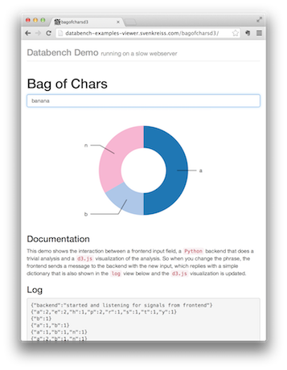

.. Databench documentation master file, created by
   sphinx-quickstart on Tue Jun 10 23:44:51 2014.
   You can adapt this file completely to your liking, but it should at least
   contain the root `toctree` directive.

.. _overview:

Overview
========

Databench is a Python package that you can install using ``pip``:

.. code-block:: bash

	$ pip install git+https://github.com/svenkreiss/databench.git

It provides an executable ``databench`` and the Python module ``databench`` as well as a JavaScript library for the frontend with the same name. Running the executable creates a local web server which you can access at http://localhost:5000. A good way to start is to jump right into :ref:`quickstart`. Other resources to get started are the `first blog post`_ and a short set of `slides from Hack and Tell NY`_.

Some features are shown in the `live demos`_. They do not include examples with parallelization or database interfaces (like asynchronously subscribing to a Redis channel) but those examples are available in the `databench_examples`_ repository.

.. image:: images/mpld3pi_demo.png
   :height: 270
   :target: http://databench-examples-viewer.svenkreiss.com/mpld3pi/

.. image:: images/mpld3_heart_path.png
   :height: 270
   :target: http://databench-examples-viewer.svenkreiss.com/mpld3Drag/

The `live demos`_ and `databench_examples`_ also show seemless integration with *markdown* and *MathJax* as well as with *angular.js*.

.. _`first blog post`: http://www.svenkreiss.com/blog/databench-initial/
.. _`slides from Hack and Tell NY`: https://speakerdeck.com/svenkreiss/databench
.. _`live demos`: http://databench-examples.svenkreiss.com/
.. _`databench_examples`: https://github.com/svenkreiss/databench_examples
.. _`markdown`: http://daringfireball.net/projects/markdown/syntax
.. _`MathJax`: http://www.mathjax.org/
.. _`angular.js`: https://angularjs.org/

Contents
--------

.. toctree::
   :maxdepth: 2

   self
   quickstart
   deploy
   backend_api
   frontend_api
   dev

Feedback
--------

The `GitHub page`_ provides a few ways for feedback in terms of *Issues* and *Pull Requests* and I am happy to receive and incorporate those. Or you can `send me an email`_.

.. _`GitHub page`: https://github.com/svenkreiss/databench
.. _`send me an email`: mailto:me@svenkreiss.com

Contributors
------------

.. include:: ../AUTHORS.rst

License
-------

Databench was written by Sven Kreiss and made available under the
`MIT license`_.

.. _`MIT license`: https://github.com/svenkreiss/databench/blob/master/LICENSE

.. Indices and tables
.. ==================

.. * :ref:`genindex`
.. * :ref:`modindex`
.. * :ref:`search`

