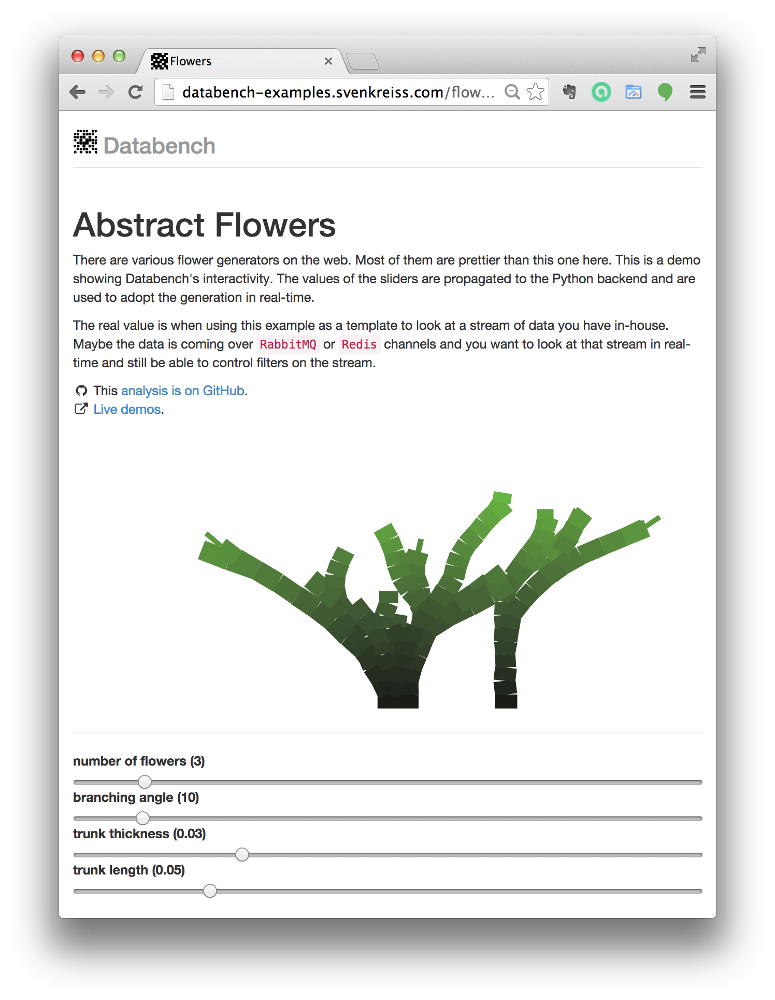

.. Databench documentation master file, created by
   sphinx-quickstart on Tue Jun 10 23:44:51 2014.
   You can adapt this file completely to your liking, but it should at least
   contain the root `toctree` directive.

.. include:: ../README.rst

.. _overview:

Overview
--------

Databench provides the executables ``scaffold-databench`` and ``databench``, Python modules for the backend and a JavaScript library for the frontend. ``scaffold-databench helloworld`` creates an analysis template called *helloworld* in the current working directory. Running ``databench`` creates a local web server which you can access at http://localhost:5000. A good way to start is to jump right into :ref:`quickstart`.

Some features are shown in the `live demos`_. They do not include examples with ``matplotlib``, parallelization or database interfaces (like asynchronously subscribing to a Redis channel) but those examples are available in the `databench_examples`_ repository.

.. image:: images/bagofcharsd3.png
    :alt: Preview of bag-of-chars demo.
    :height: 270
    :target: http://databench-examples.trivial.io/bagofcharsd3/

.. image:: images/simplepi_demo.png
    :alt: Preview of simplepi demo.
    :height: 270
    :target: http://databench-examples.trivial.io/simplepi/

.. _`first blog post`: http://www.svenkreiss.com/blog/databench-initial/
.. _`slides from Hack and Tell NY`: https://speakerdeck.com/svenkreiss/databench
.. _`live demos`: http://databench-examples.trivial.io/
.. _`databench_examples`: https://github.com/svenkreiss/databench_examples
.. _`markdown`: http://daringfireball.net/projects/markdown/syntax
.. _`MathJax`: http://www.mathjax.org/
.. _`angular.js`: https://angularjs.org/

Contents
--------

.. toctree::
    :maxdepth: 2

    self
    quickstart
    backend
    frontend
    deploy
    dev

.. Indices and tables
.. ==================

.. * :ref:`genindex`
.. * :ref:`modindex`
.. * :ref:`search`

